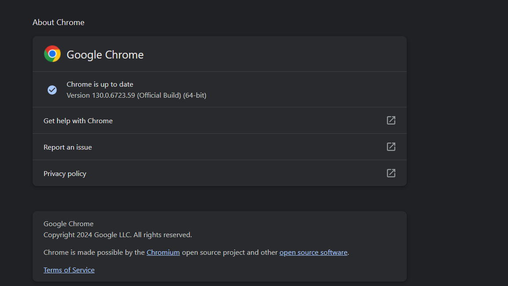

# **YouTube Video and Comment Scraper**

## **Description**
This Python script scrapes video and comment data from a specified YouTube channel and saves the information in an Excel file. It utilizes Selenium to automate web browser interactions and BeautifulSoup for parsing HTML content. We can use three different methods to scrape the YouTube channel:

1. Using BeautifulSoup
2. Using the YouTube Data API - we use GCP API code
3. Using Selenium - this method takes more time but does not require API access

we used **selenium** approch


## **Requirements**
- [Python 3.x](https://www.python.org/)
- Selenium
- Pandas
- BeautifulSoup

### **Installation**
# Necessary libraries:  requests, selenium, pandas, and openpyxl for saving data to Excel.
1. **Install Python Packages**:
   ```bash
   pip install selenium requests pandas openpyxl

### **Download Chrome WebDriver:** 
# Ensure you have the Chrome WebDriver compatible with your version of Chrome
Download chrome driver to used selenium check your chrome version and update it to new and download your selected version


-[Chrome-driver versions](https://developer.chrome.com/docs/chromedriver/downloads/version-selection)

-[My chrome Driver](https://storage.googleapis.com/chrome-for-testing-public/130.0.6723.58/win64/chromedriver-win64.zip)

### **How to Use**

1. Set the YouTube Channel URL: Replace the placeholder **channel_url** in the main function with the actual URL of the YouTube channel you wish to scrape.
    ```bash
    channel_url = 'https://www.youtube.com/@channelhandle/playlists'

if you want more channel urls you add following code line in **main** method. used following for loop
    ```bash
    for channel_url in channel_urls:
        main(channel_url)

2. Run the Script: Execute the script from the terminal:

    ```bash
    python Youtube_data_fetcher_script.py


### **Output**

The script will create an Excel file with two sheets:

1. Video Data: Contains information about each video.
2. Comments Data: Contains comments for each video.

## **Usage Example**
Here's an example of how the data will be structured in the output Excel file:

### Video Data Sheet:
| Video ID | Title              | Description         | Published Date | View Count | Like Count | Comment Count | Duration | Thumbnail URL |
|----------|--------------------|---------------------|----------------|------------|------------|----------------|----------|----------------|

### Comments Data Sheet:
| Video ID | Comment ID | Author Name | Published Date | Comment Text | Like Count |
|----------|------------|-------------|----------------|---------------|------------|


## **Note**

1. Ensure the channel has public playlists and videos to retrieve data successfully.

2. The script may take some time to run, depending on the number of videos and comments.

